# Programming and Scripting Project 2019
### Summary of Fisher's Iris Dataset by Kevin Dooley
# Background & Objectives

The aim of this project is to give an overview of the well-known Fisher's Iris data set.
The objectives of the project are as follows:

1. Research background information about the data set and write a summary about
it.
2. Keep a list of references you used in completing the project.
3. Download the data set and write some Python code to investigate it.
4. Summarise the data set by, for example, calculating the maximum, minimum and
mean of each column of the data set. A Python script will quickly do this for you.
5. Write a summary of your investigations.
6. Include supporting tables and graphics as you deem necessary.

# Dataset Background

The Iris flower data set or Fisher's Iris data set is a multivariate data set introduced by the British statistician and biologist Ronald Fisher in his 1936 paper "The use of multiple measurements in taxonomic problems as an example of linear 
discriminant analysis.". The data set consists of 50 samples from each of three species of Iris (Iris setosa, Iris virginica and Iris versicolor). Four features were measured from each sample: the length and the width of the sepals and petals, in centimetres. The data set contains 150 observations of iris flowers. 

# Getting Started

1.  If not already installed, download and install Python 3.
2.  Recommend downloading python via Anaconda to get useful additional software including Visual Studio Code and Ipython.
3.  Download and install a command prompt - recommend Cmder (Windows) or Terminal (Mac).
4.  Download the files from this repository to your desktop.

# Python Libraries Used in Project

I originally found information on the different libraries to use for this project from the lecture videos. Matplotlib and pandas were suggested to use to assist in this project. After further research I found the seaborn was also a useful library to use to graphically visualise data. Scikit-learn is a further tool available that would be perfect for this project but after research I felt this library was slightly too advanced for me at the moment and so just used the tools as mentioned above.

1. **Pandas** stands for “Python Data Analysis Library"and is open source, free to use. Pandas is quite a game changer when it comes to analyzing data with Python and it is one of the most preferred and widely used tools in data analysing if not the most used library. Pandas allows you to take data from a CSV and create a Python object with rows and columns called data frame. That data frame is then the basis for interpreting the data within the csv file.
2. **NumPy** is a package for Python for scientific computing. It supports large, multidimensional arrays and matrices, meaning it is essential for a dataset of this nature.
3. **Seaborn** is a high-level Python data visualisation library used for making attractive and informative statistical plots. It acts as a wrapper over matplotlib, and it’s used in conjunction with NumPy and pandas data structures
4. **Matplotlib** similar to seaborn is a toolkit used the visualisation of data. Matplotlib is a Python 2D plotting library which produces publication quality figures in a variety of hardcopy formats and interactive environments across platforms. 

These 4 libraries were imported into python as per below and were the foundation for this project allowing me to interpret and present the dataset.
~~~python
import numpy as np
import pandas as pd
import seaborn as sns
import matplotlib.pyplot as plt
~~~

# Starting the dataset
To be able to give an overview of Fisher's Iris dataset, I had to first obtain it. I found the dataset online and copied and saved it as a CSV file in my repository. This was saved as irisdataset.csv and was the basis of the project.

## Reading from irisdataset.csv
I refered back to the lecture in week 7 "opening files for reading and writing" which refresed my mind and provided the foundation to develop some code to read the data in irisdataset.csv. Further information on the pandas website taught me how to read a csv file are per the code below.
By importing pandas as pd, I created pd.read_csv("irisdataset.csv") which imported the dataset.

~~~python
# imported iris dataset csv file
# prints out the data set
df = pd.read_csv("irisdataset.csv")
print(df)
~~~

# Overview of the dataset
## Dataset dimensions

By using the shape property we can get a quick idea of how many rows and how many attributes columns the data contains.

~~~python
#how many rows and columns (in that order)
print(df.shape)

Output
[150 rows x 5 columns]
~~~

## Species column distribution

It is possible to group by column. In this instance I grouped the 'species' column to let me see how many rows in the dataset belong to each of the three species.
~~~python
#species distribution
print(df.groupby('species').size())

Output
species
Iris-setosa        50
Iris-versicolor    50
Iris-virginica     50
dtype: int64
~~~

# Glance at the data

By glancing at the data using the head, tail and sample functions it is possible to eyeball the data at different levels. 

**By using the head function we are able to view the first 5 rows.**
~~~python
# prints out first out first 5 rows of dataset (default)
# input any number to get that many rows displayed
print(df.head())
~~~
~~~python
 sepal_length  sepal_width  petal_length  petal_width      species
        5.1          3.5           1.4          0.2     Iris-setosa
        4.9          3.0           1.4          0.2     Iris-setosa
        4.7          3.2           1.3          0.2     Iris-setosa
        4.6          3.1           1.5          0.2     Iris-setosa
        5.0          3.6           1.4          0.2     Iris-setosa
~~~

**By using tail we are able to view the last 5 rows in the dataset.**
~~~python
#default displays last 5 rows of data set
print(df.tail())
~~~
~~~python
sepal_length  sepal_width  petal_length  petal_width         species
        6.7          3.0           5.2          2.3     Iris-virginica
        6.3          2.5           5.0          1.9     Iris-virginica
        6.5          3.0           5.2          2.0     Iris-virginica
        6.2          3.4           5.4          2.3     Iris-virginica
        5.9          3.0           5.1          1.8     Iris-virginica
~~~

**By using sample we are able to view 10 random rows within the dataset.**
~~~py
#Displays 10 random rows from the set
print(df.sample(10))
~~~
~~~python
     sepal_length  sepal_width  petal_length  petal_width          species
145           6.7          3.0           5.2          2.3   Iris-virginica
140           6.7          3.1           5.6          2.4   Iris-virginica
125           7.2          3.2           6.0          1.8   Iris-virginica
28            5.2          3.4           1.4          0.2      Iris-setosa
137           6.4          3.1           5.5          1.8   Iris-virginica
11            4.8          3.4           1.6          0.2      Iris-setosa
132           6.4          2.8           5.6          2.2   Iris-virginica
61            5.9          3.0           4.2          1.5  Iris-versicolor
142           5.8          2.7           5.1          1.9   Iris-virginica
144           6.7          3.3           5.7          2.5   Iris-virginica
~~~

By using these three simple functions it is easy to do a brief comparision for each of the variables of the data between each of the species. 
By looking at the 3rd table showing random rows you can already clearly see the 'Iris~setosa' appears to have a much smaller petal compared to the other species. There already early signs of some comparability between Iris-virginica and Iris-versicolor.

# Statistical summary

There are two methods in which you can view a summary of the dataset. The first method is using the describe function in pandas which will output a table with a statistical overview of the data. It is also possible to obtain all the same information by using each individual built in function such as min, max, mean etc.

~~~python
#outputs top level statistical analysis of the dataset ie mean, min, max etc
print(df.describe())
~~~

Below are the individual functions that can also be used to get the same information as in the table above. These can be very useful if you just require one of the calculations to be completed.

~~~python
#min, max, mean, median, standard deviation
print(df.min())
print(df.max())
print(df.std())
print(df.median())
print(df.mean())
~~~

# Visualisation

Interactive visualisation, you can take a concept a step further by using technology to drill down into charts and graphs for more detail

I used graphical techniques to further begin uncovering the structure of the data:

1. Univariate plots to better understand each attribute.
2. Multivariate plots to better understand the relationships between attributes.

## Histograms
A histogram of each input variable will give an idea of the distribution.
Matplotlib was used to generate the below histograms.

~~~python
#Histograms of all 4 variables all on one image

#gives an array of axes
#figsize - defines the size of the histogram
#bins - range
#rwidth - space between 
df.hist(figsize=(10,5), bins=10, rwidth=0.8)
~~~

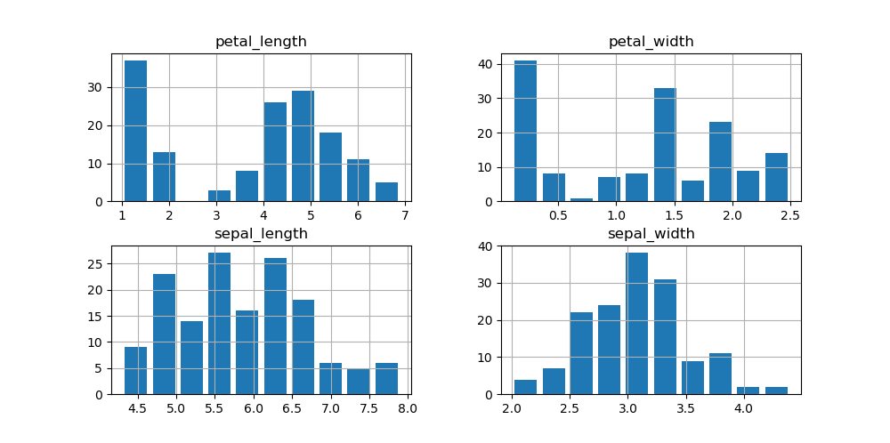

### Histogram of each individual variable

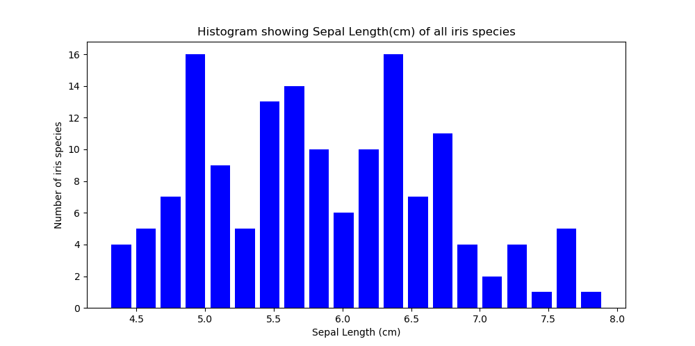

~~~python
#Separate histograms for each column
# Sepal Length
plt.figure(figsize = (10, 5)) 
x = df["sepal_length"] 

# colour of the histogram, range, layout 
plt.hist(x, color = "blue", bins=20, rwidth=0.8) 
#title of histogram
plt.title("Histogram showing Sepal Length(cm) of all iris species")
#x axis label 
plt.xlabel("Sepal Length (cm)") 
#y axis label
plt.ylabel("Number of iris species")

plt.show()
~~~

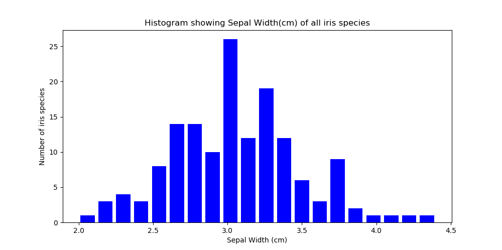

~~~python
#Sepal Width
plt.figure(figsize = (10, 5)) 
x = df["sepal_width"] 
  
plt.hist(x, color = "blue", bins=20, rwidth=0.8) 
plt.title("Histogram showing Sepal Width(cm) of all iris species") 
plt.xlabel("Sepal Width (cm)") 
plt.ylabel("Number of iris species")

plt.show()
~~~

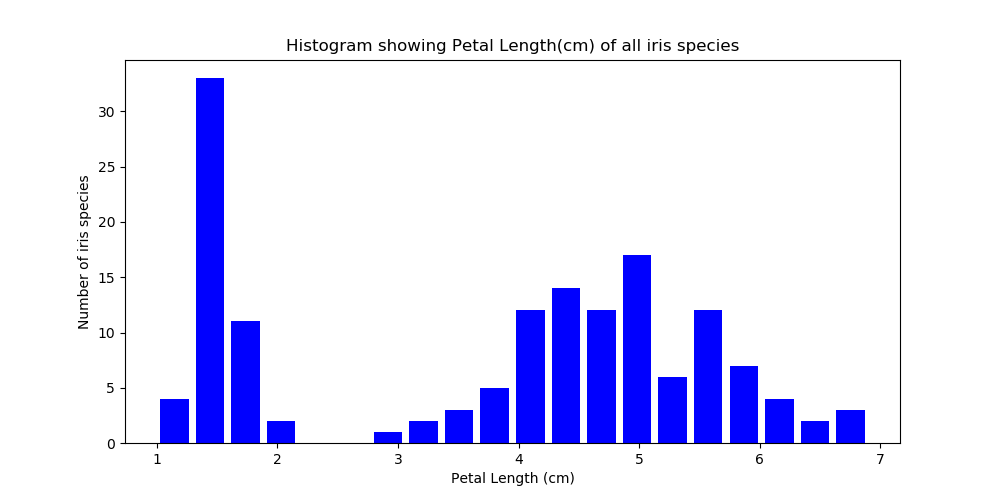

~~~python
#Petal Length
plt.figure(figsize = (10, 5)) 
x = df["petal_length"] 
  
plt.hist(x, color = "blue", bins=20, rwidth=0.8) 
plt.title("Histogram showing Petal Length(cm) of all iris species") 
plt.xlabel("Petal Length (cm)") 
plt.ylabel("Number of iris species")

plt.show()
~~~

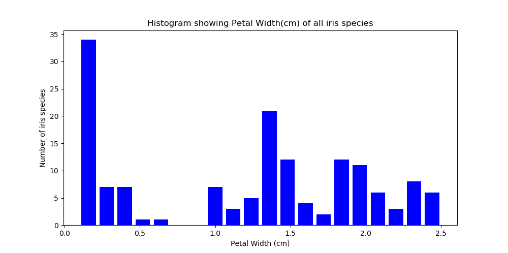

~~~python
#Petal Width
plt.figure(figsize = (10, 5)) 
x = df["petal_width"] 
  
plt.hist(x, color = "blue", bins=20, rwidth=0.8) 
plt.title("Histogram showing Petal Width(cm) of all iris species") 
plt.xlabel("Petal Width (cm)") 
plt.ylabel("Number of iris species")

plt.show()
~~~

The Setosa Petal length and width are concentrated on the far left from the rest of the species. There seems to be strong similarities between the other two species.

## Boxplots

In descriptive statistics, a box plot or boxplot is a method for graphically depicting groups of numerical data through their quartiles. Box plots may also have lines extending vertically from the boxes (whiskers) indicating variability outside the upper and lower quartiles, hence why also termed box-and-whisker plot.
By creating a box plot we can get a clearer idea of the distribution of the input attributes.

### Boxplot of each individual variable

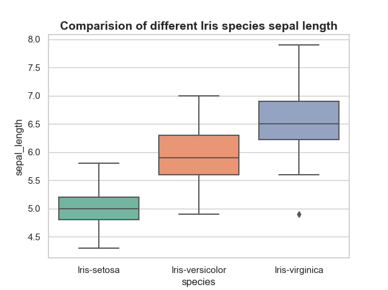

~~~python
#Comparision of species sepal length
# set the background to a white grid
sns.set(style="whitegrid", palette="Set2")
# using seaborn - box plot comparing 3 species sepal length
sns.boxplot(x="species", y="sepal_length", data=df)
plt.title("Comparision of different Iris species sepal length", fontsize=14, fontweight='bold')
plt.show()
~~~

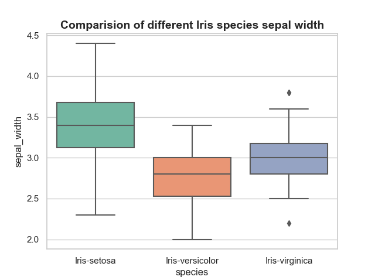

~~~python
#Comparision of species sepal width
sns.set(style="whitegrid", palette="Set2")

sns.boxplot(x="species", y="sepal_width", data=df)
plt.title("Comparision of different Iris species sepal width", fontsize=14, fontweight='bold')
plt.show()
~~~

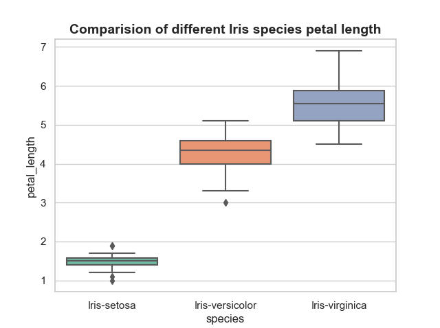

~~~python
#Comparision of species petal length
sns.set(style="whitegrid", palette="Set2")

sns.boxplot(x="species", y="petal_length", data=df)
plt.title("Comparision of different Iris species petal length", fontsize=14, fontweight='bold')
plt.show()
~~~

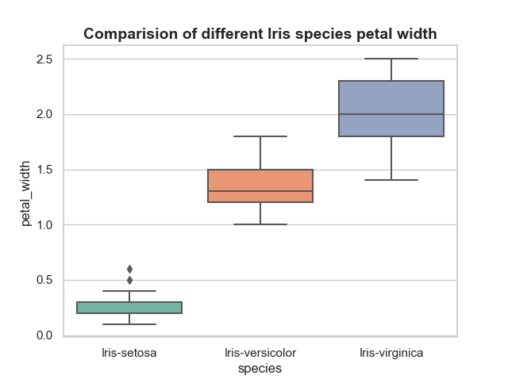

~~~python
#Comparision of species petal width
sns.set(style="whitegrid", palette="Set2")

sns.boxplot(x="species", y="petal_width", data=df)
plt.title("Comparision of different Iris species petal width", fontsize=14, fontweight='bold')
plt.show()
~~~

### Violin plot

A violin plot is a method of plotting numeric data. It is similar to a box plot, with the addition of a rotated kernel density plot on each side. Violin plots are similar to box plots, except that they also show the probability density of the data at different values.

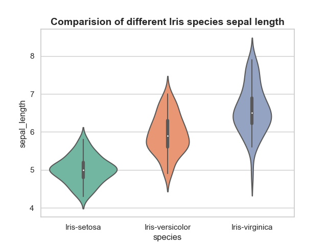

~~~python
#Comparision of species sepal length
# set the background to a white grid
sns.set(style="whitegrid", palette="Set2")
# using seaborn - violin plot comparing 3 species sepal length
sns.violinplot(x="species", y="sepal_length", data=df)
plt.title("Comparision of different Iris species sepal length", fontsize=14, fontweight='bold')
plt.show()
~~~

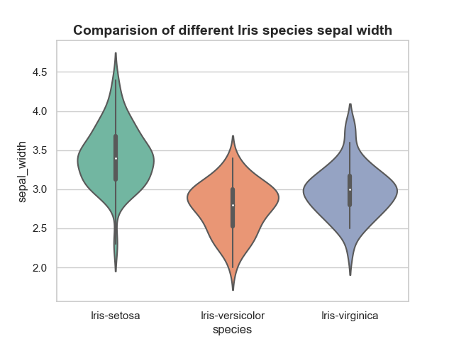

~~~python
#Comparision of species sepal width
# set the background to a white grid
sns.set(style="whitegrid", palette="Set2")
# using seaborn - violin plot comparing 3 species sepal width
sns.violinplot(x="species", y="sepal_width", data=df)
plt.title("Comparision of different Iris species sepal width", fontsize=14, fontweight='bold')
plt.show()
~~~

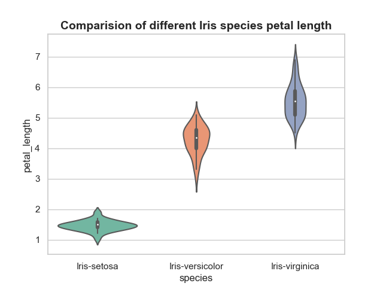

~~~python
#Comparision of species petal length
# set the background to a white grid
sns.set(style="whitegrid", palette="Set2")
# using seaborn - violin plot comparing 3 species petal length
sns.violinplot(x="species", y="petal_length", data=df)
plt.title("Comparision of different Iris species petal length", fontsize=14, fontweight='bold')
plt.show()
~~~

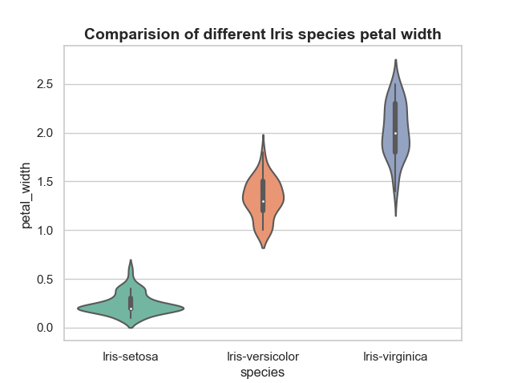

~~~python
#Comparision of species petal width
# set the background to a white grid
sns.set(style="whitegrid", palette="Set2")
# using seaborn - violin plot comparing 3 species petal width
sns.violinplot(x="species", y="petal_width", data=df)
plt.title("Comparision of different Iris species petal width", fontsize=14, fontweight='bold')
plt.show()
~~~

An overview of the three univariate plots suggests that there is strong comparability between Iris virginica and Iris versicolor regards to the flowers petal and sepal length and width. The histogram, box plot and violin all clearly indictate that the iris setosa does not share the same similarities. 

## Scatterplot 

A scatterplot is a graph in which the values of two variables are plotted along two axes, the pattern of the resulting points revealing any correlation present.

A scatterplot is a multivariate plot allows us to look at the interactions between the variables.

The below scatterplot examines all pairs of attributes. This will be helpful to spot structured relationships between input variables.

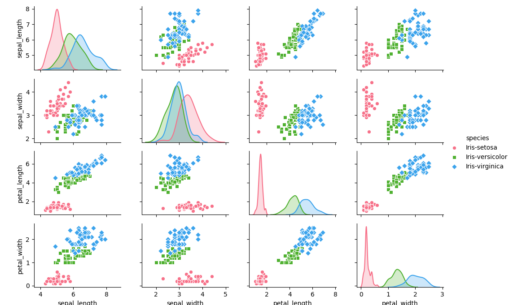

~~~python
#create a pair plot/scatter plot
#markers - gives legend 
#hue - determines which column in the data frame should be used for colour encoding
sns.pairplot(df, hue="species", palette="husl", markers=["o", "s", "D"])
#show plot

plt.show()
~~~

There appears to be diagonal grouping of some pairs of attributes. This suggests a high correlation and a predictable relationship. The scatterplot visually demonstrates iris setosa groupings away from the other two flowers. It is possible to linearly separate the setosa species from the other two, something which was suspected based on previous plots.

By reviewing the scatterplot it appears petal length and petal width potentially has the highest correlation, this could be further confirmed using a correlation plot.

# Overall summary of the dataset

The Iris data set has a number of interesting features:

Iris Setosa is linearly separable from the other two. However, the other two classes are not linearly separable.

There is similarities between the Versicolor and Virginica classes making it difficult to achieve a perfect classification rate.

# References

https://pandas.pydata.org/pandas-docs/stable/getting_started/overview.html#data-structures

https://pandas.pydata.org/pandas-docs/stable/getting_started/10min.html#minutes-to-pandas

https://blog.hedaro.com/Create-Pandas-DataFrame.html

https://www.kaggle.com/bmaria/iris-dataset

https://medium.com/codebagng/basic-analysis-of-the-iris-data-set-using-python-2995618a6342

https://www.kaggle.com/ashokdavas/iris-data-analysis-pandas-numpy

https://www.kaggle.com/lalitharajesh/iris-dataset-exploratory-data-analysis

https://www.youtube.com/watch?v=e60ItwlZTKM

https://www.kaggle.com/gopaltirupur/iris-data-analysis-and-machine-learning-python

https://www.geeksforgeeks.org/python-read-csv-using-pandas-read_csv/

https://matplotlib.org/api/_as_gen/matplotlib.pyplot.hist.html

https://www.youtube.com/watch?v=r75BPh1uk38

https://machinelearningmastery.com/machine-learning-in-python-step-by-step/

https://www.geeksforgeeks.org/box-plot-and-histogram-exploration-on-iris-data/

https://www.programiz.com/python-programming/reading-csv-files#reading-dictionary

https://seaborn.pydata.org/tutorial/distributions.html#plotting-univariate-distributions

https://seaborn.pydata.org/tutorial/distributions.html#plotting-univariate-distributions

https://seaborn.pydata.org/generated/seaborn.boxplot.html?highlight=boxplots

https://seaborn.pydata.org/tutorial/distributions.html#visualizing-pairwise-relationships-in-a-dataset

https://www.tilcode.com/add-a-screenshot-to-your-github-repo-readme-md/

https://www.markdownguide.org/extended-syntax/#syntax-highlighting
