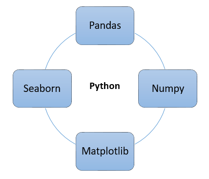

# Programming and Scripting Project 2019
### Summary of Fisher's Iris Dataset by Kevin Dooley
# Background & Objectives

The aim of this project is to give an overview of the well-known Fisher's Iris data set.
The objectives of the project are as follows:

1. Research background information about the data set and write a summary about
it.
2. Keep a list of references you used in completing the project.
3. Download the data set and write some Python code to investigate it.
4. Summarise the data set by, for example, calculating the maximum, minimum and
mean of each column of the data set. A Python script will quickly do this for you.
5. Write a summary of your investigations.
6. Include supporting tables and graphics as you deem necessary.

# Dataset Background

The Iris flower data set or Fisher's Iris data set is a multivariate data set introduced by the British statistician and biologist Ronald Fisher in his 1936 paper "The use of multiple measurements in taxonomic problems as an example of linear 
discriminant analysis.". The data set consists of 50 samples from each of three species of Iris (Iris setosa, Iris virginica and Iris versicolor). Four features were measured from each sample: the length and the width of the sepals and petals, in centimetres. The data set contains 150 observations of iris flowers. 

# Getting Started

1.  If not already installed, download and install Python 3.
2.  Recommend downloading python via Anaconda to get useful additional software including Visual Studio Code and Ipython.
3.  Download and install a command prompt - recommend Cmder (Windows) or Terminal (Mac).
4.  Download the files from this repository to your desktop.

# Python Libraries Used in Project

I originally found information on the different libraries to use for this project from the lecture videos. Matplotlib and pandas were suggested to use to assist in this project. After further research I found the seaborn was also a useful library to use to graphically visualise data. Scikit-learn is a further tool available that would be perfect for this project but after research I felt this library was slightly too advanced for me at the moment and so just used the tools as mentioned above.

(insert line on each library used)

These 4 libraries were imported into python as per below and were the foundation for this project allowing me to interpret and present the dataset.
~~~python
import numpy as np
import pandas as pd
import seaborn as sn
import matplotlib.pyplot as plt
~~~

# Starting the dataset
To be able to give an overview of Fisher's Iris dataset, I had to first obtain it. I found the dataset online and copied and saved it as a CSV file in my repository. This was saved as irisdataset.csv and was the basis of the project.

## Reading from irisdataset.csv
I refered back to the lecture in week 7 "opening files for reading and writing" which provided the foundation to develop some code to read the data in irisdataset.csv.
By importing pandas as pd, I created pd.read_csv("irisdataset.csv") which imported the dataset.

~~~python
# imported iris dataset csv file
# prints out the data set
df = pd.read_csv("irisdataset.csv")
print(df)
~~~

# Overview of the dataset
## Dataset dimensions

By using the shape property we can get a quick idea of how many rows and how many attributes columns the data contains.

~~~python
#how many rows and columns (in that order)
print(df.shape)

Output
[150 rows x 5 columns]
~~~

## Species column distribution

It is possible to group by column. In this instance I grouped the 'species' column to let me see how many rows in the dataset belong to each of the three species.
~~~python
#species distribution
print(df.groupby('species').size())

Output
species
Iris-setosa        50
Iris-versicolor    50
Iris-virginica     50
dtype: int64
~~~

# Glance at the data

By glancing at the data using the head, tail and sample functions it is possible to eyeball the data at different levels. 

**By using the head function we are able to view the first 5 rows.**
~~~python
# prints out first out first 5 rows of dataset (default)
# input any number to get that many rows displayed
print(df.head())
~~~
~~~python
 sepal_length  sepal_width  petal_length  petal_width      species
        5.1          3.5           1.4          0.2     Iris-setosa
        4.9          3.0           1.4          0.2     Iris-setosa
        4.7          3.2           1.3          0.2     Iris-setosa
        4.6          3.1           1.5          0.2     Iris-setosa
        5.0          3.6           1.4          0.2     Iris-setosa
~~~

**By using tail we are able to view the last 5 rows in the dataset.**
~~~python
#default displays last 5 rows of data set
print(df.tail())
~~~
~~~python
sepal_length  sepal_width  petal_length  petal_width         species
        6.7          3.0           5.2          2.3     Iris-virginica
        6.3          2.5           5.0          1.9     Iris-virginica
        6.5          3.0           5.2          2.0     Iris-virginica
        6.2          3.4           5.4          2.3     Iris-virginica
        5.9          3.0           5.1          1.8     Iris-virginica
~~~

**By using sample we are able to view 10 random rows within the dataset.**
~~~py
#Displays 10 random rows from the set
print(df.sample(10))
~~~
~~~python
     sepal_length  sepal_width  petal_length  petal_width          species
145           6.7          3.0           5.2          2.3   Iris-virginica
140           6.7          3.1           5.6          2.4   Iris-virginica
125           7.2          3.2           6.0          1.8   Iris-virginica
28            5.2          3.4           1.4          0.2      Iris-setosa
137           6.4          3.1           5.5          1.8   Iris-virginica
11            4.8          3.4           1.6          0.2      Iris-setosa
132           6.4          2.8           5.6          2.2   Iris-virginica
61            5.9          3.0           4.2          1.5  Iris-versicolor
142           5.8          2.7           5.1          1.9   Iris-virginica
144           6.7          3.3           5.7          2.5   Iris-virginica
~~~

By using these three simple functions it is easy to do a brief comparision for each of the variables of the data between each of the species. 
By looking at the 3rd table showing random rows you can already clearly see the 'Iris~setosa' appears to have a much smaller petal compared to the other species. There aleady early signs of comparability between Iris-virginica and Iris-versicolor.

# Statistical summary

There are two methods in which you can view a summary of the dataset. The firat method is using the describe function in pandas which will output a table with a statistical overview of the data. It is also possible to obtain all the same information by using each individual built in function such as min, max, mean etc.

~~~python
#outputs top level statistical analysis of the dataset ie mean, min, max etc
print(df.describe())
~~~

Below are the individual functions that can also be used to get the same information as in the table above. These can be very useful if you just require one of the calculations to be completed.

~~~python
#min, max, mean, median, standard deviation
print(df.min())
print(df.max())
print(df.std())
print(df.median())
print(df.mean())
~~~